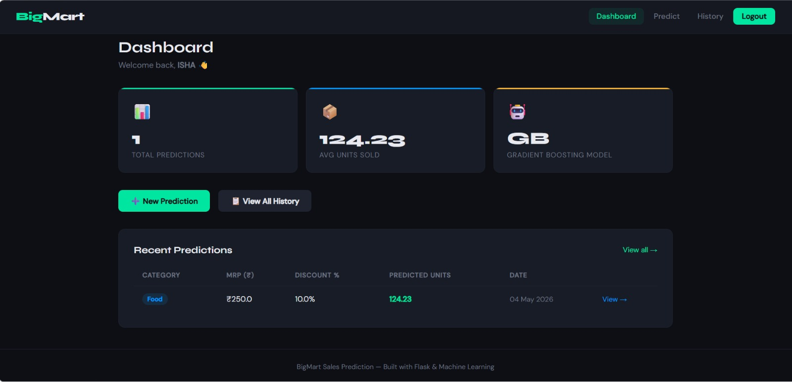
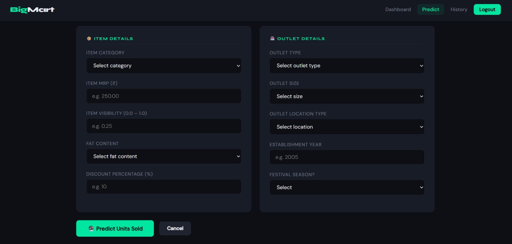
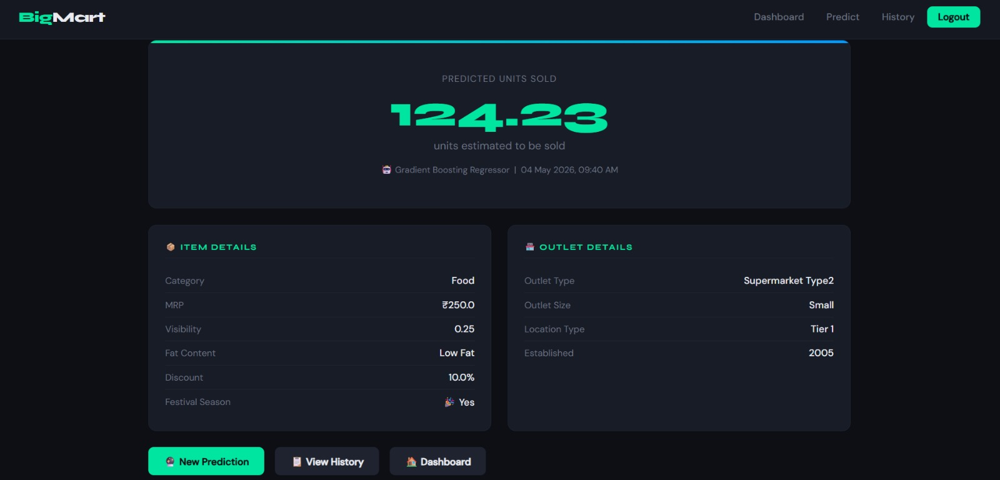

# 🛒 BigMart Sales Prediction Web Application

A Flask-based web application that predicts retail sales using a **Gradient Boosting** machine learning model — with user authentication, prediction history, and an analytics dashboard.

---

## 📸 Screenshots





---

## 🎯 Features

- **Authentication** — Sign up, login, logout with secure password hashing
- **Sales Prediction** — Input item & outlet details to get predicted units sold
- **Dashboard** — View total predictions, average sales, recent activity
- **Prediction History** — Full table of all past predictions with details
- **Model Comparison** — Linear Regression vs Random Forest vs Gradient Boosting
- **Secure** — Session management, SQL injection prevention, user data isolation

---

## 📊 Model Performance

| Metric | Linear Regression | Random Forest | Gradient Boosting |
|--------|:-----------------:|:-------------:|:-----------------:|
| R² Score | ~0.50 | ~0.84 | **~0.86+** ✅ |
| RMSE | ~18.5 | ~15.9 | **~14.8** ✅ |

> **Gradient Boosting** was selected as the final model after comparing all three algorithms.

---

## 🏗️ Architecture

| Layer | Technology |
|-------|-----------|
| Frontend | Custom HTML/CSS + Jinja2 Templates |
| Backend | Flask (Python) |
| Database | SQLite via SQLAlchemy ORM |
| ML Model | Gradient Boosting Regressor (scikit-learn) |
| Auth | Werkzeug password hashing + Flask sessions |

---

## 📁 Project Structure

```
BigMart-Sales-Prediction/
├── app.py                        # Main Flask application
├── train_model.py                # Model training script
├── init_db.py                    # Database initializer
├── requirements.txt              # Python dependencies
├── .env                          # Environment variables (not committed)
├── random_forest_model.ipynb     # EDA + model training notebook
├── big_market_sales_dataset.csv  # Training dataset
├── rf_model.pkl                  # Saved Gradient Boosting model
├── screenshots/                  # App screenshots
└── templates/
    ├── base.html                 # Base layout with navbar
    ├── login.html                # Login page
    ├── signup.html               # Registration page
    ├── dashboard.html            # User dashboard
    ├── predict.html              # Prediction form
    ├── result.html               # Prediction result
    ├── history.html              # Prediction history
    ├── 404.html                  # 404 error page
    └── 500.html                  # 500 error page
```

---

## 🚀 Quick Start

### 1. Clone the Repository
```bash
git clone https://github.com/kananiisha/Big-Mart-Sales-Prediction.git
cd Big-Mart-Sales-Prediction
```

### 2. Create Virtual Environment
```bash
python -m venv .venv
.venv\Scripts\activate        # Windows
source .venv/bin/activate     # Mac/Linux
```

### 3. Install Dependencies
```bash
pip install -r requirements.txt
```

### 4. Setup Environment Variables
Create a `.env` file in the root folder:
```
SECRET_KEY=your-secret-key-here
FLASK_DEBUG=False
```

### 5. Train the Model
```bash
python train_model.py
```

### 6. Initialize Database
```bash
python init_db.py
```

### 7. Run the Application
```bash
python app.py
```

Visit `http://localhost:5000` in your browser.

---

## 📝 API Routes

| Route | Method | Auth | Purpose |
|-------|--------|------|---------|
| `/` | GET | No | Redirects to dashboard or login |
| `/signup` | GET, POST | No | User registration |
| `/login` | GET, POST | No | User authentication |
| `/logout` | GET | Yes | Clear session |
| `/dashboard` | GET | Yes | User dashboard |
| `/predict` | GET, POST | Yes | Prediction form |
| `/result/<id>` | GET | Yes | Prediction result |
| `/history` | GET | Yes | All predictions |

---

## 🛢️ Database Schema

**User**
```
id (PK) | name | email (unique) | password_hash | created_at
```

**Prediction**
```
id (PK) | user_id (FK) | item_category | item_mrp | item_visibility
item_fat_content | outlet_type | outlet_size | outlet_location_type
outlet_establishment_year | festival_flag | discount_percentage
predicted_units_sold | timestamp
```

---

## 🔐 Security

- Password hashing via `werkzeug.security`
- Flask session-based authentication
- SQLAlchemy ORM prevents SQL injection
- Users can only access their own predictions
- Secret key loaded from `.env` environment variable
- Debug mode disabled in production

---

## 📦 Dependencies

```
flask
flask-sqlalchemy
pandas
scikit-learn
joblib
werkzeug
numpy
python-dotenv
```

---

## 🤝 Contributing

1. Fork the repo
2. Create a feature branch (`git checkout -b feature/your-feature`)
3. Commit your changes (`git commit -m 'Add your feature'`)
4. Push to the branch (`git push origin feature/your-feature`)
5. Open a Pull Request

---

## 📄 License

MIT License — free to use and modify.

---

**Built with ❤️ using Flask + Gradient Boosting ML**
